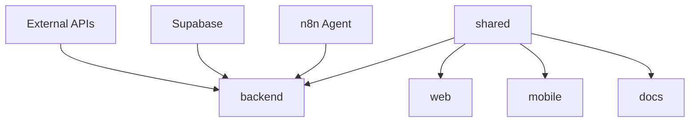

# Development Guide

This guide provides detailed information for developers working on the Verding platform.

## 🎯 Development Philosophy

Verding follows an **agent-first development approach** where:

1. **Natural Language First**: Features must be accessible via conversational interfaces
2. **Progressive Enhancement**: Start with agent capabilities, add GUI for enhancement
3. **Type Safety**: Comprehensive TypeScript usage across all packages
4. **Testing**: Test-driven development with comprehensive coverage
5. **Documentation**: Living documentation that evolves with the code

## 🏗️ Architecture Overview

### Monorepo Structure

```
verding/
├── packages/
│   ├── shared/           # Core types, utilities, constants
│   ├── backend/          # API server, business logic
│   ├── web/              # React web application
│   ├── mobile/           # React Native mobile app
│   └── docs/             # Documentation package
├── scripts/              # Build and utility scripts
├── .github/              # CI/CD workflows
├── memory-bank/          # Project context and documentation
└── tasks/               # Task Master project management
```

### Package Dependencies



### Development Flow

1. **Shared Package**: Define types, constants, utilities
2. **Backend Package**: Implement business logic and APIs
3. **Frontend Packages**: Build user interfaces
4. **Integration**: Connect all packages through shared interfaces

## 🔧 Development Environment

### Prerequisites

- **Node.js**: v18+ (LTS recommended)
- **npm**: v9+ (comes with Node.js)
- **Git**: Latest version
- **Code Editor**: VS Code recommended with extensions:
  - TypeScript
  - ESLint
  - Prettier
  - Auto Rename Tag
  - Bracket Pair Colorizer

### Setup Steps

1. **Clone Repository**
   ```bash
   git clone <repository-url>
   cd verding
   ```

2. **Install Dependencies**
   ```bash
   npm install
   ```

3. **Environment Configuration**
   ```bash
   # Copy environment template
   cp env.template .env
   
   # Edit with your values
   code .env
   ```

4. **Verify Setup**
   ```bash
   # Build all packages
   npm run build
   
   # Run tests
   npm run test
   
   # Start development servers
   npm run dev
   ```

### VS Code Configuration

Create `.vscode/settings.json`:

```json
{
  "typescript.preferences.importModuleSpecifier": "relative",
  "editor.formatOnSave": true,
  "editor.codeActionsOnSave": {
    "source.fixAll.eslint": true
  },
  "files.associations": {
    "*.env*": "dotenv"
  },
  "search.exclude": {
    "**/node_modules": true,
    "**/dist": true,
    "**/coverage": true
  }
}
```

## 📦 Package Development

### Shared Package (@verding/shared)

**Purpose**: Central source of truth for types, utilities, and constants.

**Key Modules**:
- `types.ts` - TypeScript interfaces and types
- `utils.ts` - Common utility functions
- `env.ts` - Environment validation schemas
- `constants.ts` - Design system, business rules, configuration

**Development Pattern**:
```typescript
// 1. Define types
export interface User {
  id: string;
  email: string;
  role: UserRole;
}

// 2. Export from index
export * from './types';

// 3. Use in other packages
import { User } from '@verding/shared';
```

### Backend Package (@verding/backend)

**Purpose**: API server with business logic and external integrations.

**Key Components**:
- Express.js server with TypeScript
- Supabase integration
- MCP tools for agent communication
- Environment validation

**Development Pattern**:
```typescript
// src/routes/users.ts
import { Router } from 'express';
import { User } from '@verding/shared';

const router = Router();

router.get('/users', async (req, res) => {
  // Implementation
});

export default router;
```

### Web Package (@verding/web)

**Purpose**: React web application with modern tooling.

**Key Technologies**:
- React 18.2+ with TypeScript
- Vite for fast development
- React Query for data fetching
- Zustand for state management

**Development Pattern**:
```tsx
// src/components/UserCard.tsx
import { User, DESIGN_SYSTEM } from '@verding/shared';

interface UserCardProps {
  user: User;
}

export const UserCard: React.FC<UserCardProps> = ({ user }) => {
  return (
    <div style={{ padding: DESIGN_SYSTEM.SPACING.DEFAULT }}>
      {user.email}
    </div>
  );
};
```

### Mobile Package (@verding/mobile)

**Purpose**: Cross-platform mobile app with React Native and Expo.

**Key Technologies**:
- React Native 0.72+
- Expo SDK 49+
- React Navigation
- Shared design system

**Development Pattern**:
```tsx
// src/screens/UserScreen.tsx
import React from 'react';
import { View, Text } from 'react-native';
import { DESIGN_SYSTEM } from '@verding/shared';

export const UserScreen: React.FC = () => {
  return (
    <View style={{ padding: DESIGN_SYSTEM.SPACING.DEFAULT }}>
      <Text>User Screen</Text>
    </View>
  );
};
```

## 🎨 Design System Integration

### Using Design Constants

Always use shared constants for consistent styling:

```typescript
import { DESIGN_SYSTEM } from '@verding/shared';

// Spacing
const containerStyle = {
  padding: DESIGN_SYSTEM.SPACING.DEFAULT,
  margin: DESIGN_SYSTEM.SPACING.LARGE,
};

// Colors
const buttonStyle = {
  backgroundColor: DESIGN_SYSTEM.COLORS.PRIMARY_EARTH_GREEN,
  borderRadius: DESIGN_SYSTEM.COMPONENTS.CORNER_RADIUS.MEDIUM,
};

// Breakpoints
const isDesktop = window.innerWidth >= DESIGN_SYSTEM.BREAKPOINTS.DESKTOP;
```

### Responsive Design

Follow mobile-first approach:

```css
/* Mobile first */
.container {
  padding: 16px; /* DESIGN_SYSTEM.SPACING.DEFAULT */
}

/* Tablet and up */
@media (min-width: 600px) { /* DESIGN_SYSTEM.BREAKPOINTS.TABLET */
  .container {
    padding: 24px; /* DESIGN_SYSTEM.SPACING.MEDIUM */
  }
}

/* Desktop and up */
@media (min-width: 1024px) { /* DESIGN_SYSTEM.BREAKPOINTS.DESKTOP */
  .container {
    padding: 32px; /* DESIGN_SYSTEM.SPACING.LARGE */
  }
}
```

## 🧪 Testing Strategy

### Unit Tests

Test individual functions and components:

```typescript
// utils.test.ts
import { formatDate } from './utils';

describe('formatDate', () => {
  it('should format date correctly', () => {
    const date = new Date('2023-12-25');
    expect(formatDate(date)).toBe('Dec 25, 2023');
  });
});
```

### Integration Tests

Test package interactions:

```typescript
// shared-integration.test.ts
import { DESIGN_SYSTEM } from '@verding/shared';

describe('Design System Integration', () => {
  it('should have consistent spacing values', () => {
    expect(DESIGN_SYSTEM.SPACING.DEFAULT).toBe(16);
    expect(DESIGN_SYSTEM.SPACING.LARGE).toBeGreaterThan(DESIGN_SYSTEM.SPACING.DEFAULT);
  });
});
```

### Component Tests

Test React components:

```tsx
// UserCard.test.tsx
import { render, screen } from '@testing-library/react';
import { UserCard } from './UserCard';

const mockUser = {
  id: '1',
  email: 'test@example.com',
  role: 'user' as const,
};

describe('UserCard', () => {
  it('should display user email', () => {
    render(<UserCard user={mockUser} />);
    expect(screen.getByText('test@example.com')).toBeInTheDocument();
  });
});
```

## 🔄 Development Workflow

### Daily Development

1. **Start with Task Master**
   ```bash
   npm run tasks:next
   ```

2. **Create Feature Branch**
   ```bash
   git checkout -b feature/task-1-2-some-feature
   ```

3. **Development Loop**
   ```bash
   # Start development servers
   npm run dev
   
   # Run tests in watch mode
   npm run test:watch
   
   # Validate changes
   npm run lint
   npm run type-check
   ```

4. **Update Task Progress**
   ```bash
   npm run tasks:status 1.2 in-progress
   # Work on implementation
   npm run tasks:status 1.2 done
   ```

### Code Quality Checks

Pre-commit hooks automatically run:
- ESLint with auto-fix
- Prettier formatting
- TypeScript compilation

Manual quality checks:
```bash
# Full validation
npm run ci:validate

# Individual checks
npm run lint
npm run type-check
npm run test
npm run build
```

### Dependency Management

```bash
# Add dependency to specific package
npm install --workspace=@verding/backend express

# Add dev dependency
npm install --workspace=@verding/web --save-dev @types/react

# Validate dependencies
npm run deps:validate

# Update dependencies (Renovate handles this automatically)
npm update
```

### Version Management

```bash
# Patch version (0.1.0 → 0.1.1)
npm run version:patch

# Minor version (0.1.0 → 0.2.0)
npm run version:minor

# Major version (0.1.0 → 1.0.0)
npm run version:major

# Release
npm run release:patch
```

## 🔍 Debugging

### Backend Debugging

```bash
# Start with debugging
npm run dev:backend -- --inspect

# Or with VS Code launch configuration
```

VS Code `launch.json`:
```json
{
  "version": "0.2.0",
  "configurations": [
    {
      "name": "Debug Backend",
      "type": "node",
      "request": "launch",
      "program": "${workspaceFolder}/packages/backend/src/index.ts",
      "outFiles": ["${workspaceFolder}/packages/backend/dist/**/*.js"],
      "runtimeArgs": ["-r", "tsx"]
    }
  ]
}
```

### Frontend Debugging

Use browser dev tools and React DevTools extension.

For VS Code debugging:
```json
{
  "name": "Debug Web",
  "type": "chrome",
  "request": "launch",
  "url": "http://localhost:5173",
  "webRoot": "${workspaceFolder}/packages/web/src"
}
```

## 📊 Performance

### Build Performance

Monitor build times:
```bash
# Build with timing
npm run build -- --verbose

# Analyze bundle size
npm run build:analyze
```

### Runtime Performance

- Use React DevTools Profiler
- Monitor bundle sizes
- Lazy load components
- Optimize images and assets

## 🔐 Security Considerations

### Environment Variables

Never commit sensitive data:
```bash
# Good - using environment variable
const apiKey = process.env.STRIPE_SECRET_KEY;

// Bad - hardcoded secret
const apiKey = 'sk_test_123...';
```

### Input Validation

Always validate inputs with Zod:
```typescript
import { z } from 'zod';

const userSchema = z.object({
  email: z.string().email(),
  age: z.number().min(0).max(120),
});

const validatedUser = userSchema.parse(userData);
```

### Authentication

Use Supabase Auth consistently:
```typescript
import { supabase } from './supabase';

const { data: user, error } = await supabase.auth.getUser();
if (error || !user) {
  throw new Error('Unauthorized');
}
```

## 🚀 Deployment

### Local Testing

```bash
# Build for production
npm run build:production

# Test production build
npm run preview
```

### Staging Deployment

```bash
# Deploy to staging
npm run deploy:staging

# Verify deployment
curl https://staging.verding.app/health
```

### Production Deployment

```bash
# Deploy to production
npm run deploy:production

# Monitor deployment
npm run logs:production
```

## 📚 Learning Resources

### TypeScript
- [TypeScript Handbook](https://www.typescriptlang.org/docs/)
- [React TypeScript Cheatsheet](https://react-typescript-cheatsheet.netlify.app/)

### React/React Native
- [React Documentation](https://react.dev/)
- [React Native Documentation](https://reactnative.dev/)
- [Expo Documentation](https://docs.expo.dev/)

### Testing
- [Jest Documentation](https://jestjs.io/docs/getting-started)
- [React Testing Library](https://testing-library.com/docs/react-testing-library/intro/)

### Monorepo Management
- [Turborepo Documentation](https://turbo.build/repo/docs)
- [npm Workspaces](https://docs.npmjs.com/cli/v7/using-npm/workspaces)

---

**Happy coding! 🌱** 