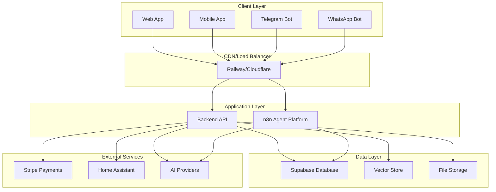

# Deployment Guide

This guide covers deployment strategies, environment setup, and operational procedures for the Verding platform.

## 🏗️ Infrastructure Overview

### Architecture Components



## 🌐 Environment Configuration

### Environment Hierarchy

1. **Development** - Local development and testing
2. **Staging** - Pre-production testing and validation
3. **Production** - Live system serving users

### Environment Variables

Each environment requires specific configuration:

```bash
# Environment identification
NODE_ENV=production
ENVIRONMENT=production

# Application
APP_NAME=verding
APP_VERSION=0.1.1
API_URL=https://api.verding.app
WEB_URL=https://app.verding.app

# Database
SUPABASE_URL=https://your-project.supabase.co
SUPABASE_ANON_KEY=your_anon_key
SUPABASE_SERVICE_ROLE_KEY=your_service_role_key

# n8n Agent Platform
N8N_WEBHOOK_URL=https://your-n8n.app.webhook
N8N_API_KEY=your_n8n_api_key

# External Integrations
TELEGRAM_BOT_TOKEN=your_telegram_bot_token
WHATSAPP_ACCESS_TOKEN=your_whatsapp_token
STRIPE_SECRET_KEY=your_stripe_secret_key

# AI Services
OPENAI_API_KEY=your_openai_key
ANTHROPIC_API_KEY=your_anthropic_key
PERPLEXITY_API_KEY=your_perplexity_key

# Security
JWT_SECRET=your_jwt_secret
CORS_ORIGINS=https://app.verding.app,https://verding.app

# Monitoring
LOG_LEVEL=info
SENTRY_DSN=your_sentry_dsn
```

## 🚀 Railway Deployment

### Backend Deployment

1. **Prepare Railway Project**
   ```bash
   # Install Railway CLI
   npm install -g @railway/cli
   
   # Login to Railway
   railway login
   
   # Initialize project
   railway init
   ```

2. **Configure Build Settings**
   
   Create `railway.json`:
   ```json
   {
     "build": {
       "builder": "nixpacks",
       "buildCommand": "npm run build:backend"
     },
     "deploy": {
       "startCommand": "npm run start:backend",
       "healthcheckPath": "/health"
     }
   }
   ```

3. **Environment Variables**
   ```bash
   # Set production environment variables
   railway variables set NODE_ENV=production
   railway variables set SUPABASE_URL=your_url
   railway variables set SUPABASE_SERVICE_ROLE_KEY=your_key
   # ... set all required variables
   ```

4. **Deploy**
   ```bash
   # Deploy backend
   railway up
   
   # Monitor deployment
   railway logs
   ```

### Frontend Deployment

1. **Web Application (Vercel/Netlify)**
   ```bash
   # Build configuration for Vercel
   echo '{"buildCommand": "npm run build:web", "outputDirectory": "packages/web/dist"}' > vercel.json
   
   # Deploy to Vercel
   npx vercel --prod
   ```

2. **Mobile Application**
   ```bash
   # Build for app stores
   npm run build:mobile:ios
   npm run build:mobile:android
   
   # Submit to app stores using Expo
   npx eas submit --platform ios
   npx eas submit --platform android
   ```

## 🔄 CI/CD Pipeline

### GitHub Actions Workflow

`.github/workflows/deploy-production.yml`:

```yaml
name: Deploy Production

on:
  push:
    branches: [main]
    tags: ['v*']

env:
  NODE_VERSION: '18'

jobs:
  test:
    runs-on: ubuntu-latest
    steps:
      - uses: actions/checkout@v4
      
      - name: Setup Node.js
        uses: actions/setup-node@v4
        with:
          node-version: ${{ env.NODE_VERSION }}
          cache: 'npm'
      
      - name: Install dependencies
        run: npm ci
      
      - name: Run tests
        run: npm run test
      
      - name: Type check
        run: npm run type-check
      
      - name: Lint
        run: npm run lint
      
      - name: Build
        run: npm run build

  deploy-backend:
    needs: test
    runs-on: ubuntu-latest
    if: github.ref == 'refs/heads/main'
    
    steps:
      - uses: actions/checkout@v4
      
      - name: Deploy to Railway
        uses: railway-app/railway@v1
        with:
          service: backend
          token: ${{ secrets.RAILWAY_TOKEN }}
        env:
          NODE_ENV: production
          SUPABASE_URL: ${{ secrets.SUPABASE_URL }}
          SUPABASE_SERVICE_ROLE_KEY: ${{ secrets.SUPABASE_SERVICE_ROLE_KEY }}

  deploy-web:
    needs: test
    runs-on: ubuntu-latest
    if: github.ref == 'refs/heads/main'
    
    steps:
      - uses: actions/checkout@v4
      
      - name: Setup Node.js
        uses: actions/setup-node@v4
        with:
          node-version: ${{ env.NODE_VERSION }}
          cache: 'npm'
      
      - name: Install dependencies
        run: npm ci
      
      - name: Build web application
        run: npm run build:web
        env:
          VITE_API_URL: https://api.verding.app
          VITE_SUPABASE_URL: ${{ secrets.SUPABASE_URL }}
          VITE_SUPABASE_ANON_KEY: ${{ secrets.SUPABASE_ANON_KEY }}
      
      - name: Deploy to Vercel
        uses: vercel/action@v1
        with:
          vercel-token: ${{ secrets.VERCEL_TOKEN }}
          vercel-org-id: ${{ secrets.VERCEL_ORG_ID }}
          vercel-project-id: ${{ secrets.VERCEL_PROJECT_ID }}
          vercel-args: '--prod'

  deploy-mobile:
    needs: test
    runs-on: ubuntu-latest
    if: startsWith(github.ref, 'refs/tags/v')
    
    steps:
      - uses: actions/checkout@v4
      
      - name: Setup Node.js
        uses: actions/setup-node@v4
        with:
          node-version: ${{ env.NODE_VERSION }}
          cache: 'npm'
      
      - name: Setup Expo
        uses: expo/expo-github-action@v8
        with:
          expo-version: latest
          token: ${{ secrets.EXPO_TOKEN }}
      
      - name: Install dependencies
        run: npm ci
      
      - name: Build mobile app
        run: npm run build:mobile
      
      - name: Submit to app stores
        run: |
          npx eas submit --platform ios --non-interactive
          npx eas submit --platform android --non-interactive
```

### Staging Workflow

`.github/workflows/deploy-staging.yml`:

```yaml
name: Deploy Staging

on:
  push:
    branches: [develop]
  pull_request:
    branches: [main]

env:
  NODE_VERSION: '18'

jobs:
  deploy-staging:
    runs-on: ubuntu-latest
    
    steps:
      - uses: actions/checkout@v4
      
      - name: Setup Node.js
        uses: actions/setup-node@v4
        with:
          node-version: ${{ env.NODE_VERSION }}
          cache: 'npm'
      
      - name: Install dependencies
        run: npm ci
      
      - name: Run tests
        run: npm run test
      
      - name: Build
        run: npm run build
      
      - name: Deploy to staging
        run: npm run deploy:staging
        env:
          RAILWAY_TOKEN: ${{ secrets.RAILWAY_STAGING_TOKEN }}
          VERCEL_TOKEN: ${{ secrets.VERCEL_TOKEN }}
```

## 🗄️ Database Management

### Supabase Setup

1. **Project Creation**
   ```sql
   -- Enable required extensions
   CREATE EXTENSION IF NOT EXISTS "uuid-ossp";
   CREATE EXTENSION IF NOT EXISTS "vector";
   
   -- Enable Row Level Security
   ALTER DATABASE postgres SET row_security = on;
   ```

2. **Schema Migration**
   ```bash
   # Run migrations
   npm run db:migrate:production
   
   # Seed production data
   npm run db:seed:production
   ```

3. **Backup Strategy**
   ```bash
   # Automated daily backups
   supabase db dump --db-url $SUPABASE_URL > backup-$(date +%Y%m%d).sql
   
   # Store in cloud storage
   aws s3 cp backup-$(date +%Y%m%d).sql s3://verding-backups/
   ```

### Data Migration

```bash
# Export from staging
supabase db dump --db-url $STAGING_SUPABASE_URL > staging-export.sql

# Import to production (carefully!)
# Test on staging copy first
supabase db reset --db-url $PRODUCTION_SUPABASE_URL
psql $PRODUCTION_SUPABASE_URL < staging-export.sql
```

## 🔐 Security Configuration

### SSL/TLS Setup

Railway automatically provides SSL certificates. For custom domains:

```bash
# Add custom domain in Railway dashboard
# DNS records required:
# CNAME api.verding.app -> your-service.railway.app
# CNAME app.verding.app -> your-web-deployment.vercel.app
```

### Environment Security

```bash
# Rotate secrets regularly
npm run security:rotate-secrets

# Audit dependencies
npm audit --audit-level high
npm run security:scan
```

### CORS Configuration

```typescript
// packages/backend/src/middleware/cors.ts
import cors from 'cors';

const corsOptions = {
  origin: process.env.CORS_ORIGINS?.split(',') || ['http://localhost:3000'],
  credentials: true,
  optionsSuccessStatus: 200,
};

export default cors(corsOptions);
```

## 📊 Monitoring & Observability

### Health Checks

```typescript
// packages/backend/src/routes/health.ts
import { Router } from 'express';
import { supabase } from '../lib/supabase';

const router = Router();

router.get('/health', async (req, res) => {
  try {
    // Check database connection
    const { error } = await supabase.from('health_check').select('*').limit(1);
    
    if (error) throw error;
    
    res.json({
      status: 'healthy',
      timestamp: new Date().toISOString(),
      version: process.env.APP_VERSION,
      uptime: process.uptime(),
    });
  } catch (error) {
    res.status(503).json({
      status: 'unhealthy',
      error: error.message,
    });
  }
});

export default router;
```

### Logging Configuration

```typescript
// packages/backend/src/lib/logger.ts
import winston from 'winston';

const logger = winston.createLogger({
  level: process.env.LOG_LEVEL || 'info',
  format: winston.format.combine(
    winston.format.timestamp(),
    winston.format.errors({ stack: true }),
    winston.format.json()
  ),
  transports: [
    new winston.transports.Console(),
    new winston.transports.File({ filename: 'logs/error.log', level: 'error' }),
    new winston.transports.File({ filename: 'logs/combined.log' }),
  ],
});

export default logger;
```

### Error Tracking

```typescript
// packages/backend/src/lib/sentry.ts
import * as Sentry from '@sentry/node';

Sentry.init({
  dsn: process.env.SENTRY_DSN,
  environment: process.env.NODE_ENV,
  integrations: [
    new Sentry.Integrations.Http({ tracing: true }),
    new Sentry.Integrations.Express({ app }),
  ],
  tracesSampleRate: 1.0,
});

export default Sentry;
```

## 🚨 Incident Response

### Rollback Procedures

```bash
# Quick rollback to previous version
railway rollback

# Rollback web deployment
vercel rollback

# Database rollback (if needed)
npm run db:rollback:production
```

### Emergency Procedures

1. **Service Down**
   ```bash
   # Check service status
   railway status
   
   # View logs
   railway logs --tail
   
   # Scale up if needed
   railway scale --replicas 3
   ```

2. **Database Issues**
   ```bash
   # Check database health
   curl https://api.verding.app/health
   
   # Restore from backup
   npm run db:restore:production
   ```

3. **High Traffic**
   ```bash
   # Scale services
   railway scale --replicas 5
   
   # Enable CDN caching
   # Check Cloudflare/Vercel settings
   ```

## 📈 Performance Optimization

### Caching Strategy

```typescript
// packages/backend/src/middleware/cache.ts
import Redis from 'ioredis';

const redis = new Redis(process.env.REDIS_URL);

export const cacheMiddleware = (ttl: number = 300) => {
  return async (req, res, next) => {
    const key = `cache:${req.originalUrl}`;
    
    try {
      const cached = await redis.get(key);
      if (cached) {
        return res.json(JSON.parse(cached));
      }
      
      // Override res.json to cache response
      const originalJson = res.json;
      res.json = function(data) {
        redis.setex(key, ttl, JSON.stringify(data));
        return originalJson.call(this, data);
      };
      
      next();
    } catch (error) {
      next();
    }
  };
};
```

### Database Optimization

```sql
-- Add indexes for common queries
CREATE INDEX idx_tasks_property_id ON tasks(property_id);
CREATE INDEX idx_orders_status_created ON orders(status, created_at);

-- Enable query optimization
ANALYZE;
```

## 🔄 Maintenance Procedures

### Regular Maintenance

```bash
# Weekly maintenance script
#!/bin/bash

# Update dependencies (Renovate handles this automatically)
npm update

# Run security audit
npm audit

# Clean up logs
find logs/ -name "*.log" -mtime +30 -delete

# Database maintenance
npm run db:maintenance:production

# Health check
curl -f https://api.verding.app/health || exit 1

echo "Maintenance completed successfully"
```

### Backup Procedures

```bash
# Daily backup script
#!/bin/bash

DATE=$(date +%Y%m%d_%H%M%S)

# Database backup
supabase db dump --db-url $SUPABASE_URL > "backups/db_backup_$DATE.sql"

# Code backup
git archive --format=tar.gz --output="backups/code_backup_$DATE.tar.gz" HEAD

# Upload to cloud storage
aws s3 sync backups/ s3://verding-backups/

# Clean old backups (keep 30 days)
find backups/ -name "*.sql" -mtime +30 -delete
find backups/ -name "*.tar.gz" -mtime +30 -delete
```

## 📋 Deployment Checklist

### Pre-Deployment

- [ ] All tests passing
- [ ] Code review completed
- [ ] Environment variables updated
- [ ] Database migrations tested
- [ ] Security scan completed
- [ ] Performance testing completed
- [ ] Backup created

### Deployment

- [ ] Deploy to staging first
- [ ] Smoke tests on staging
- [ ] Deploy to production
- [ ] Health checks passing
- [ ] Monitor logs for errors
- [ ] Verify all services running

### Post-Deployment

- [ ] Run end-to-end tests
- [ ] Monitor performance metrics
- [ ] Check error rates
- [ ] Verify integrations working
- [ ] Update documentation
- [ ] Notify team of completion

---

**Remember: Always test deployments on staging first! 🚀** 