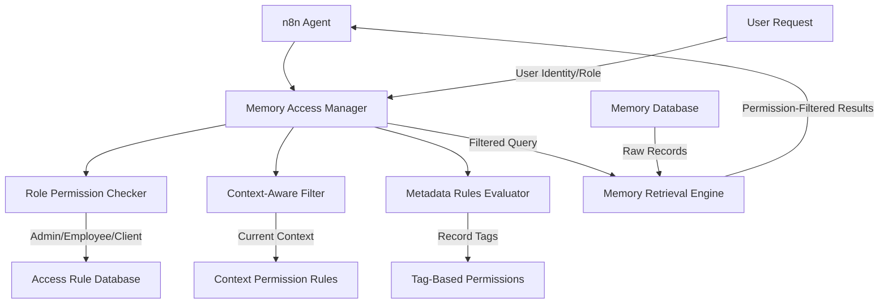
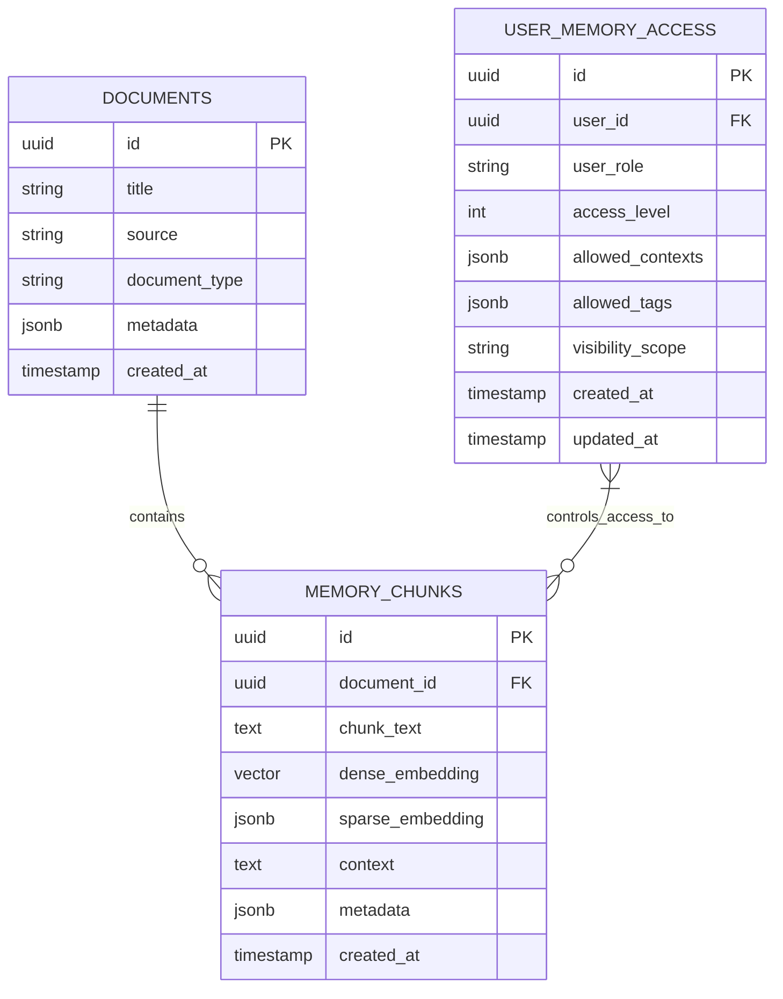
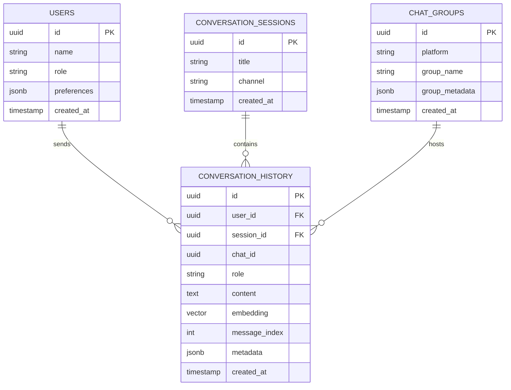
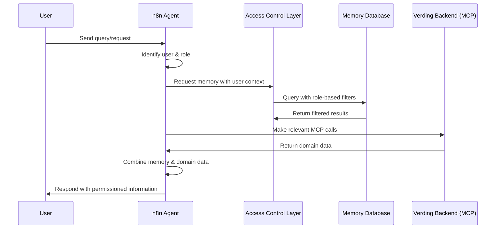

## Agent Memory System Design Visual

This document provides a visual representation and detailed description
specifically of the external n8n Agent Core's memory system design using
Supabase and Google Drive.

### Agent's Memory System Design Diagram

Below is a diagram illustrating the components and flows of the agent's
direct-access memory system utilizing Supabase and Google Drive for replication.

```mermaid
graph TD
    GD_Drop[Google Drive Drop Folder<br>(Human Input)] --> GD_Trigger(Google Drive Trigger<br>on Changes)
    Channel_Input[Communication Channels<br>(Email, Chat, etc.)] --> Channel_Trigger(Channel Trigger)
    Agent_Generated[Agent Generated Content] --> Agent_Processing(Agent Processing)

    GD_Trigger --> IngestionWorkflow[Document/Content Ingestion Workflow (n8n)]
    Channel_Trigger --> IngestionWorkflow
    Agent_Processing --> IngestionWorkflow

    IngestionWorkflow -- Process Content<br>(Read, Chunk, Embed, Contextualize) --> SupabaseMemory[Supabase Memory Database<br>(pgvector, Hybrid Search)]

    SupabaseMemory -- Stores Processed Data<br>(Chunks, Embeddings, History, Metadata) --> SupabaseMemory

    IngestionWorkflow -- Replicate Content/Metadata<br>(Maintain Directory Structure) --> GD_MemoryReplica[Google Drive Memory Replica<br>(Human Readable Interface)]

    GD_MemoryReplica -- Human Edits/Deletions --> GD_Trigger
    GD_MemoryReplica -- Contains README & Index --> Human_User[Human User]
    Human_User --> GD_MemoryReplica

    MainAgentWorkflow[Main Agent Workflow (n8n)] -- User Query Requires Memory --> RetrievalWorkflow[Memory Retrieval Workflow (n8n)]

    RetrievalWorkflow -- Receive User Query --> QueryEmbedding[Generate Query Embeddings<br>(Dense & Sparse)]

    QueryEmbedding -- Query Database <br>(Hybrid Search on Chunks & History) --> SupabaseMemory

    SupabaseMemory -- Returns Relevant Data<br>(Chunks, History, Source Info) --> RetrievalWorkflow

    RetrievalWorkflow -- Re-ranking (Optional) --> RankedData[Ranked Relevant Data]

    RankedData --> MainAgentWorkflow[Main Agent Workflow (n8n)<br>Uses Data for Response Generation]

    MainAgentWorkflow -- Stores Conversation History --> SupabaseMemory
    MainAgentWorkflow -- Needs Conversation History --> SupabaseMemory

    SupabaseMemory -- Accessed Directly By --> IngestionWorkflow
    SupabaseMemory -- Accessed Directly By --> RetrievalWorkflow
    SupabaseMemory -- Accessed Directly By --> MainAgentWorkflow

    IngestionWorkflow -- Updates README & Index --> GD_MemoryReplica

```

### Agent's Memory System Design Details (Direct DB Access from n8n to Supabase & Google Drive Integration)

The agent's memory will be implemented as a knowledge base using a
vector-capable database (Supabase) that supports hybrid RAG for long-term
knowledge and conversation history, with a critical component being the
replication and management of memory content in Google Drive for human
readability and interaction.

**1. Database Selection:**

- We will use **Supabase (PostgreSQL with `pg_vector` and TSVector)** as the
  primary memory database.
- It will store document chunks, conversation history, metadata, dense vector
  embeddings (for semantic search), and sparse vector representations (for
  keyword/full-text search).
- It allows efficient querying using both dense and sparse vectors
  simultaneously (hybrid search).

**2. Database Schema (in Supabase):**

- `memory_chunks` table: Stores the processed document/content chunks.

  - `id`: UUID (Primary Key)
  - `document_id`: UUID (Foreign Key to `documents` table)
  - `chunk_text`: TEXT (The actual text content of the chunk)
  - `dense_embedding`: vector (Vector storing the dense embedding, requires
    `pgvector` extension)
  - `sparse_embedding`: JSONB (Storing sparse embedding data)
  - `context`: TEXT (Additional contextual information)
  - `metadata`: JSONB (Flexible field for other relevant data, including access
    control tags like access_level and visibility_tags)
  - `created_at`: TIMESTAMP (Timestamp of ingestion)

- `conversation_history` table: Stores the turns of conversations.

  - `id`: UUID (Primary Key)
  - `user_id`: UUID (Foreign Key to a `users` table in the main backend) -
    _Needs clarification on how user ID is managed across systems._
  - `session_id`: UUID (To group messages within a conversation session)
  - `message_index`: INT (To maintain message order within a session)
  - `speaker`: TEXT ('user' or 'agent')
  - `message_text`: TEXT (The content of the message)
  - `timestamp`: TIMESTAMP (Timestamp of the message)
  - `embedding`: vector (Optional: Could store embeddings for conversational
    retrieval)
  - `access_level`: TEXT (For role-based access control)
  - `visibility_tags`: TEXT[] (Array of tags for granular access control)

- `documents` table: Stores metadata about the source documents and their Google
  Drive replica status.
  - `id`: UUID (Primary Key)
  - `gdrive_drop_path`: TEXT (Original path in the Google Drive drop folder -
    _This folder should always be empty after processing_)
  - `gdrive_replica_path`: TEXT (Current path in the Google Drive memory replica
    directory)
  - `last_modified_agent`: TIMESTAMP (Timestamp of last modification by the
    agent)
  - `last_modified_human`: TIMESTAMP (Timestamp of last modification by a human
    in the replica)
  - `status`: TEXT (e.g., 'processing', 'active', 'deleted', 'conflict')

**3. Document/Content Ingestion Workflow (in n8n):**

- **Purpose:** To process new documents/content from various sources and add
  them to Supabase memory, replicating in Google Drive.
- **Triggers:** Google Drive Trigger (monitoring the drop folder and the memory
  replica directory for changes), Channel Triggers (for content via email/chat),
  Internal Agent Triggers (for agent-generated content).
- **Steps:**
  - Receive trigger notification/content.
  - If from drop folder: Read document, move/copy to appropriate location in
    Google Drive memory replica. Delete from drop folder.
  - If from channel/agent: Process content into a suitable format for
    storage/replication.
  - Process Content: Chunking logic, Contextualization (n8n LLM node), Generate
    Embeddings (dense and sparse).
  - Store in Supabase: Insert/update data in `memory_chunks` and `documents`
    tables.
  - Replicate in Google Drive: If content was not from Google Drive originally,
    create/update a representation in the Google Drive memory replica (e.g., a
    markdown file). Ensure directory structure is maintained by the agent.
  - Update Google Drive `Index` and `README` files based on current memory
    content and structure.
  - Handle human edits/deletions in the Google Drive memory replica: Trigger
    ingestion workflow, sync changes to Supabase, update `Index`/`README`.
    Implement conflict resolution if needed.

**4. Memory Retrieval Workflow (in n8n):**

- **Purpose:** To find relevant information in Supabase memory based on a query.
- **Trigger:** Internal trigger from the main agent workflow.
- **Steps:**
  - Receive User Query.
  - Generate Query Embeddings (dense and sparse).
  - Query Supabase: Perform hybrid search on `memory_chunks` table, joining with
    `documents` to get source information (like Google Drive replica path).
  - Fuse/Re-rank Results.
  - Return Relevant Data: Output top results, including chunk text and
    source/replica information, to the main agent workflow.

**5. Conversation History Management (in Supabase via n8n):**

- **Purpose:** To store and retrieve conversation turns for context in Supabase.
- **Steps:**
  - Store user inputs and agent responses in the `conversation_history` table as
    they occur.
  - Retrieve recent conversation turns from `conversation_history` for context.

This detailed design integrates Google Drive as a crucial part of the agent's
memory system, providing human-readable access and a two-way sync mechanism
alongside the Supabase database.

# Agent Memory Design - Visual Representation

## Overall System Architecture Diagram

Below is a diagram illustrating the main components of the Verding system and
their communication pathways.

```mermaid
graph TD
    User[User] --> Channels[Communication Channels<br>(Telegram, WhatsApp, Email, Web/Mobile GUI)]
    Channels --> n8nAgent[External n8n Agent Core]

    n8nAgent -- Orchestration, LLM Processing --> n8nWorkflows[n8n Workflows<br>(Input Processing, Intent Recognition,<br>Response Generation)]

    n8nWorkflows -- Direct Database Access <br>(Hybrid RAG: Read/Write Chunks) --> MemoryDB[Memory Database<br>(Supabase PostgreSQL w/ pgvector)]

    AccessControl[Role-Based Access Control] -- Filters Memory Access --> n8nWorkflows
    UserRoles[User Roles<br>(Client, Employee, Admin)] --> AccessControl

    n8nWorkflows -- MCP Calls (JSON-RPC) --> VerdingBackend[Main Verding Backend]
    VerdingBackend -- Handles MCP Requests --> BackendServices[Backend Services<br>(BUJO, Inventory, Sensors, etc.)]
    VerdingBackend -- Accesses Data --> BackendDatabases[Backend Databases<br>(Operational Data)]

    n8nWorkflows -- Formulates Response from <br>Memory & Backend Results --> Channels

    MemoryDB -- Stores/Retrieves --> DocumentChunks[Document Chunks<br>+ Context + Embeddings<br>+ Access Control Metadata]
    MemoryDB -- Stores/Retrieves --> ConversationHistory[Conversation History<br>+ User Context<br>+ Group Chat Context]

    BackendServices -- Interacts with --> BackendDatabases

    CustomDashboards[Customizable<br>Monitoring Screens] --> VerdingBackend
```

## User Role Based Access Control Diagram

This diagram illustrates how the memory system implements role-based access
control:



## Agent Memory Database Schema

The Agent's memory system uses Supabase (PostgreSQL with pgvector) with the
following core tables:

### 1. Document and Chunk Storage



### 2. Conversation History Storage



## Memory Retrieval With Access Control Flow



This visual representation illustrates how the external n8n Agent Core manages
memory with role-based access control while communicating with the main Verding
system via MCP for all backend functionalities.
