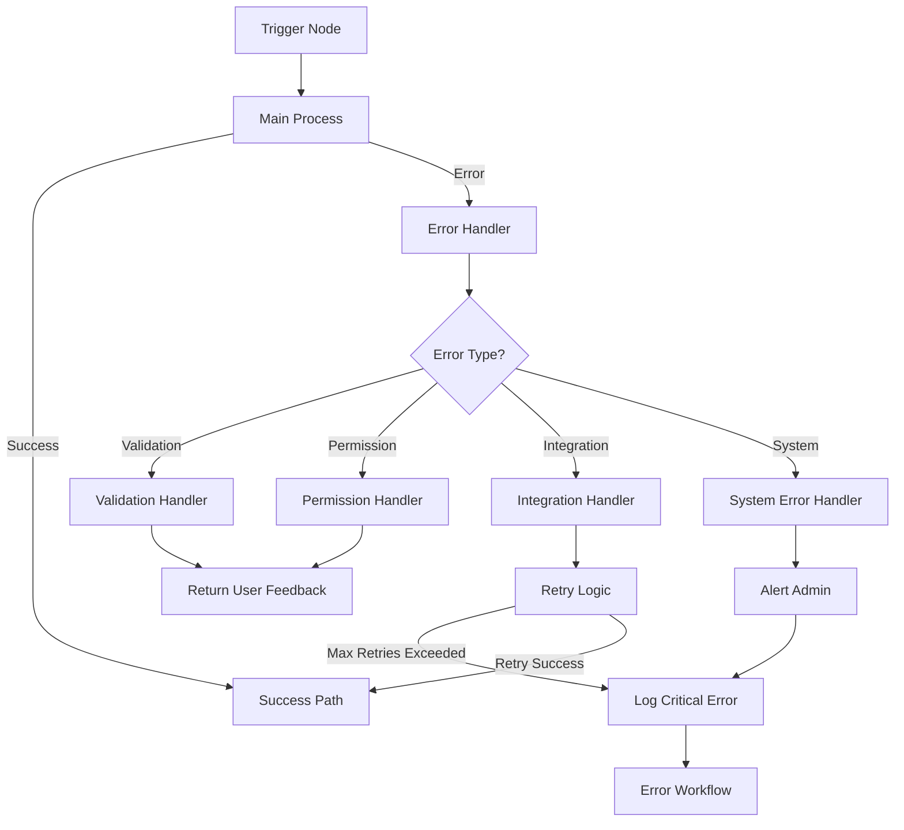

# Error Handling and Recovery Procedures

**⚠️ CRITICAL: READ [PROJECT BRIEF](projectbrief.md) FIRST ⚠️** - The Project
Brief contains the complete Memory Bank navigation guide and reading order for
first interaction. Always start there after any memory reset.

## Overview

This document defines the comprehensive error handling strategy for the Verding
system, covering both the main backend and the external n8n agent. It details
how to detect, categorize, report, and recover from different types of errors
across the system, ensuring a resilient and user-friendly experience.

## 1. Error Categorization Framework

### 1.1 Error Severity Levels

| Level | Name     | Description                                                        | Response Time      | User Notification            |
| ----- | -------- | ------------------------------------------------------------------ | ------------------ | ---------------------------- |
| 1     | Critical | System-wide failure affecting multiple users or core functionality | Immediate          | Immediate, all channels      |
| 2     | High     | Service disruption affecting a specific feature or user            | < 1 hour           | Immediate, affected users    |
| 3     | Medium   | Non-critical functionality affected, workaround available          | < 24 hours         | Contextual notification      |
| 4     | Low      | Minor issues with minimal impact                                   | Next release cycle | None or passive notification |
| 5     | Info     | Informational events, not errors                                   | N/A                | None                         |

### 1.2 Error Categories

#### 1.2.1 System Errors

- **Infrastructure Errors**: Server, database, network failures
- **Resource Errors**: Out of memory, CPU overload, disk space
- **Dependency Errors**: External service unavailability (OpenAI, Stripe, etc.)
- **Security Errors**: Authentication failures, authorization violations,
  intrusion attempts

#### 1.2.2 Application Errors

- **Data Validation Errors**: Invalid input, format issues, constraint
  violations
- **Business Logic Errors**: Process failures, state inconsistencies
- **Integration Errors**: API format mismatches, timeout issues
- **Concurrency Errors**: Race conditions, deadlocks

#### 1.2.3 User Experience Errors

- **Input Errors**: User provided invalid data
- **Configuration Errors**: User misconfiguration
- **Permission Errors**: User lacks required permissions
- **Expectation Errors**: System behaved differently than user expected

#### 1.2.4 Agent-Specific Errors

- **NLP Understanding Errors**: Failed to parse user intent
- **Context Management Errors**: Lost conversation context
- **Channel Communication Errors**: Failed to send/receive on specific channels
- **Workflow Execution Errors**: n8n workflow failures

## 2. Error Detection Mechanisms

### 2.1 Main Backend Detection

#### 2.1.1 Proactive Detection

- **Health Checks**: Regular internal and external service health monitoring
- **Resource Monitoring**: CPU, memory, disk space, connection pool monitoring
- **Performance Thresholds**: Response time, throughput, error rate monitoring
- **Dependency Checks**: External service availability validation

#### 2.1.2 Reactive Detection

- **Exception Handling**: Structured try/catch blocks with appropriate
  granularity
- **Middleware Interception**: Global error handlers for unhandled exceptions
- **Database Error Handling**: Specific handlers for database constraints and
  errors
- **API Response Validation**: Ensure all responses meet expected format and
  quality

### 2.2 n8n Agent Detection

#### 2.2.1 Workflow-Level Detection

- **Error Trigger Nodes**: Dedicated error handling workflows using Error
  Trigger nodes
- **If-Else Error Paths**: Conditional error handling within workflows
- **Timeout Monitoring**: Detection of execution timeouts
- **Result Validation**: Checking output from each node for expected
  format/content

#### 2.2.2 Node-Level Detection

- **HTTP Status Validation**: Checking response codes from API calls
- **JSON Schema Validation**: Validating data against expected schemas
- **Custom JavaScript Validation**: Code nodes with custom validation logic
- **LLM Response Validation**: Verifying AI-generated content meets requirements

## 3. Error Reporting and Logging

### 3.1 Logging Strategy

#### 3.1.1 Log Levels and Content

| Level | When to Use                              | Information to Include                                            |
| ----- | ---------------------------------------- | ----------------------------------------------------------------- |
| ERROR | System failures, exceptions              | Error details, stack trace, context data, user ID (if applicable) |
| WARN  | Potential issues, degraded performance   | Warning details, affected component, metrics                      |
| INFO  | Significant events, state changes        | Event details, relevant IDs, changed properties                   |
| DEBUG | Detailed information for troubleshooting | Verbose data, method parameters, intermediate states              |
| TRACE | Very detailed debugging information      | Step-by-step execution flow                                       |

#### 3.1.2 Structured Logging Format

All logs will use a consistent JSON format with the following fields:

```json
{
  "timestamp": "ISO-8601 timestamp",
  "level": "ERROR|WARN|INFO|DEBUG|TRACE",
  "service": "service name",
  "traceId": "unique trace identifier",
  "userId": "user ID if authenticated",
  "message": "human-readable message",
  "data": {
    // Contextual data specific to the event
  },
  "error": {
    "name": "error type/name",
    "message": "error message",
    "stack": "stack trace",
    "code": "error code"
  }
}
```

#### 3.1.3 Log Storage and Retention

- **Short-term Storage**: 30 days in hot storage for immediate access
- **Long-term Archive**: 1 year in cold storage for compliance and pattern
  analysis
- **Log Rotation**: Daily rotation with compression for efficient storage

### 3.2 Error Monitoring and Alerting

#### 3.2.1 Real-time Monitoring

- **Dashboard**: Real-time error dashboard showing system health
- **Error Aggregation**: Group similar errors to identify patterns
- **Trend Analysis**: Track error rates over time to identify degradation

#### 3.2.2 Alert Configuration

| Severity | Alert Channel            | Responder                  | SLA                   |
| -------- | ------------------------ | -------------------------- | --------------------- |
| Critical | SMS, Phone, Email, Slack | On-call Engineer + Manager | 15 min acknowledgment |
| High     | SMS, Email, Slack        | On-call Engineer           | 1 hour acknowledgment |
| Medium   | Email, Slack             | Development Team           | Next business day     |
| Low      | Slack                    | Development Team           | Weekly review         |

### 3.3 n8n-Specific Error Reporting

#### 3.3.1 Workflow Execution Logs

- All workflow executions are logged with input/output data
- Failed executions retain error information and last successful node
- Execution history is retained for 30 days for debugging

#### 3.3.2 Custom Error Reporting Workflows

- Dedicated error reporting workflows triggered by Error Trigger nodes
- Send detailed error notifications to appropriate channels
- Log extended error context for complex workflows

## 4. Error Recovery Procedures

### 4.1 Automatic Recovery

#### 4.1.1 Retry Mechanisms

- **Exponential Backoff**: Increasing delays between retry attempts
- **Circuit Breakers**: Prevent cascading failures by temporarily disabling
  failing components
- **Fallback Options**: Alternative paths when primary options fail. _e.g., For
  monitoring widgets, if data cannot be fetched after configured retries, the
  widget should display a clear 'data unavailable' or 'error loading widget
  data' message within its own area, rather than allowing the error to disrupt
  the entire dashboard. A manual refresh option for the widget could also be
  provided._
- **Idempotent Operations**: Ensure operations can be safely retried

#### 4.1.2 Self-Healing Processes

- **Service Restart**: Automatic restart of failed services
- **Connection Pool Management**: Automatic pruning and recreation of stale
  connections
- **Cache Invalidation**: Automatic clearing of potentially corrupt cache data
- **Load Shedding**: Temporarily rejecting non-critical requests during overload

### 4.2 Manual Recovery

#### 4.2.1 Incident Response Procedures

1. **Detection**: Alert triggered or issue reported
2. **Triage**: Assess severity and impact
3. **Containment**: Prevent further damage or exposure
4. **Resolution**: Apply fix or workaround
5. **Verification**: Confirm issue is resolved
6. **Root Cause Analysis**: Determine underlying cause
7. **Documentation**: Record incident details and resolution
8. **Prevention**: Implement measures to prevent recurrence

#### 4.2.2 Rollback Procedures

- **Database Rollback**: Procedures for reverting database changes
- **Deployment Rollback**: Process for reverting to previous application version
- **Configuration Rollback**: Method for restoring previous configuration
- **Data Recovery**: Procedures for data restoration from backups
- **Application-Specific Configurations**:
  - _e.g., **Dashboard Configuration Recovery:** User-defined configurations,
    such as monitoring dashboard layouts and widget settings, are critical to
    user experience. Ideally, the system storing these configurations (likely
    the main application database) should support mechanisms for restoring a
    specific dashboard to a previously known good state if it becomes corrupted
    (e.g., through versioning or snapshotting of individual dashboard
    configurations). If such granular recovery is not feasible, procedures
    should clearly define how users can be assisted in manually recreating their
    configurations, and this data loss possibility should be communicated
    transparently if it occurs._

### 4.3 n8n-Specific Recovery

#### 4.3.1 Workflow Recovery

- **Checkpoint Nodes**: Use Wait nodes as recovery checkpoints in long workflows
- **State Persistence**: Store workflow state for recovery using Workflow Static
  Data
- **Modular Design**: Break complex workflows into smaller, recoverable units
- **Error Workflow Activation**: Trigger specialized recovery workflows on
  failure

#### 4.3.2 Resume Strategies

- **Resume from Failure Point**: Continue execution from last successful node
- **Alternative Path Execution**: Execute alternative workflow branches on
  failure
- **Compensating Workflows**: Execute cleanup workflows for partial completions
- **Manual Intervention Prompts**: Request human intervention for critical
  recovery decisions

## 5. User Communication Strategy

### 5.1 Error Messages

#### 5.1.1 Message Guidelines

- **User-Friendly**: Clear, non-technical language for user-facing errors
- **Actionable**: Include what the user can do to resolve the issue
- **Contextual**: Relevant to the user's current task or goal
- **Consistent**: Follow the same format and tone across the system

#### 5.1.2 Message Templates

| Error Type   | Template Example                                                                              |
| ------------ | --------------------------------------------------------------------------------------------- |
| Validation   | "Please check [field]: [specific issue]. [How to fix]"                                        |
| Permission   | "You don't have permission to [action]. [How to request access]"                              |
| Availability | "[Feature] is currently unavailable. We're working on it and expect it to be back by [time]." |
| Input Format | "Please provide [field] in [expected format]. Example: [example]"                             |

### 5.2 Communication Channels

#### 5.2.1 In-App Notifications

- **Toast Messages**: For transient, non-critical errors
- **Modal Dialogs**: For errors requiring immediate attention
- **Banner Alerts**: For system-wide issues affecting all users
- **Status Page**: For ongoing incidents with regular updates

#### 5.2.2 External Notifications

- **Email**: For critical account or data-related issues
- **SMS/Push**: For urgent action-required notifications
- **Messaging Platforms**: Use existing Telegram/WhatsApp integration for status
  updates
- **System Status Page**: Public page showing system health and incidents

### 5.3 Agent Communication

#### 5.3.1 Natural Language Error Responses

- **Conversational**: Maintain natural dialogue even when reporting errors
- **Contextual Understanding**: Acknowledge user's goal despite the error
- **Solution-Oriented**: Offer alternatives or workarounds when available
- **Follow-Up Guidance**: Suggest next steps or offer to connect with support

#### 5.3.2 Multi-Channel Consistency

- Ensure consistent error messaging across all agent communication channels
- Adapt message format to channel constraints while maintaining content
  consistency
- Provide channel-specific recovery options when appropriate

## 6. Implementation Approach

### 6.1 Main Backend Implementation

#### 6.1.1 Error Handling Architecture

```typescript
// Global error handling middleware (Express example)
app.use((err, req, res, next) => {
  const errorId = uuidv4(); // Generate unique error ID

  // Log structured error
  logger.error({
    errorId,
    message: err.message,
    stack: err.stack,
    userId: req.user?.id,
    path: req.path,
    method: req.method,
    query: req.query,
    body: sanitizeRequestBody(req.body),
  });

  // Determine public error message
  const publicMessage =
    process.env.NODE_ENV === 'production'
      ? 'An unexpected error occurred'
      : err.message;

  // Return structured error response
  res.status(err.statusCode || 500).json({
    error: {
      id: errorId,
      message: publicMessage,
      code: err.code || 'INTERNAL_ERROR',
      details: err.publicDetails || null,
    },
  });
});
```

#### 6.1.2 Custom Error Classes

```typescript
// Base application error class
class AppError extends Error {
  statusCode: number;
  code: string;
  publicDetails?: any;

  constructor(
    message: string,
    statusCode = 500,
    code = 'INTERNAL_ERROR',
    publicDetails?: any
  ) {
    super(message);
    this.statusCode = statusCode;
    this.code = code;
    this.publicDetails = publicDetails;
    Object.setPrototypeOf(this, AppError.prototype);
  }
}

// Specialized error classes
class ValidationError extends AppError {
  constructor(message: string, details?: any) {
    super(message, 400, 'VALIDATION_ERROR', details);
    Object.setPrototypeOf(this, ValidationError.prototype);
  }
}

class NotFoundError extends AppError {
  constructor(resource: string, id?: string) {
    const message = id
      ? `${resource} with ID ${id} not found`
      : `${resource} not found`;
    super(message, 404, 'NOT_FOUND');
    Object.setPrototypeOf(this, NotFoundError.prototype);
  }
}
```

#### 6.1.3 Supabase Error Handling

```typescript
// Function to handle Supabase errors
function handleSupabaseError(error: any): AppError {
  // Detect error type from Supabase response
  if (error.code === '23505') {
    return new ValidationError(
      'A record with this information already exists',
      {
        constraint: error.detail,
      }
    );
  }

  if (error.code === '23503') {
    return new ValidationError('Referenced record does not exist', {
      constraint: error.detail,
    });
  }

  if (error.code === '42501') {
    return new AppError('Permission denied', 403, 'FORBIDDEN');
  }

  // Default error handling
  return new AppError('Database operation failed', 500, 'DATABASE_ERROR');
}
```

### 6.2 MCP Error Handling

#### 6.2.1 MCP Error Response Format

```json
{
  "id": "unique-error-identifier",
  "code": "ERROR_CODE",
  "message": "Human-readable error message",
  "details": {
    "field": "specific field with error",
    "reason": "specific reason for the error",
    "suggestion": "suggested fix"
  },
  "timestamp": "2023-04-22T12:34:56Z",
  "requestId": "original-request-id"
}
```

#### 6.2.2 MCP Error Codes

| Category       | Code Pattern | Example                       |
| -------------- | ------------ | ----------------------------- |
| Authentication | AUTH\_\*     | AUTH_INVALID_TOKEN            |
| Authorization  | AUTHZ\_\*    | AUTHZ_INSUFFICIENT_PERMISSION |
| Validation     | VALID\_\*    | VALID_MISSING_REQUIRED_FIELD  |
| Resource       | RES\_\*      | RES_NOT_FOUND                 |
| Business Logic | BIZ\_\*      | BIZ_OPERATION_FAILED          |
| Integration    | INT\_\*      | INT_SERVICE_UNAVAILABLE       |
| System         | SYS\_\*      | SYS_INTERNAL_ERROR            |

### 6.3 n8n Implementation

#### 6.3.1 Error Handling Workflow Pattern



#### 6.3.2 Error Trigger Implementation

Example n8n Error Trigger workflow:

```json
{
  "nodes": [
    {
      "parameters": {},
      "name": "Error Trigger",
      "type": "n8n-nodes-base.errorTrigger",
      "typeVersion": 1,
      "position": [250, 300]
    },
    {
      "parameters": {
        "keepOnlySet": true,
        "values": {
          "string": [
            {
              "name": "errorType",
              "value": "={{ $json.execution.error.message.includes('API rate limit') ? 'RATE_LIMIT' : $json.execution.error.message.includes('Permission denied') ? 'PERMISSION' : 'SYSTEM' }}"
            },
            {
              "name": "errorMessage",
              "value": "={{ $json.execution.error.message }}"
            },
            {
              "name": "workflowName",
              "value": "={{ $json.workflow.name }}"
            },
            {
              "name": "executionId",
              "value": "={{ $json.execution.id }}"
            },
            {
              "name": "timestamp",
              "value": "={{ new Date().toISOString() }}"
            }
          ]
        },
        "options": {}
      },
      "name": "Process Error",
      "type": "n8n-nodes-base.set",
      "typeVersion": 2,
      "position": [450, 300]
    },
    {
      "parameters": {
        "conditions": {
          "string": [
            {
              "value1": "={{ $json.errorType }}",
              "operation": "equal",
              "value2": "RATE_LIMIT"
            }
          ]
        }
      },
      "name": "Rate Limit Error?",
      "type": "n8n-nodes-base.if",
      "typeVersion": 1,
      "position": [650, 300]
    },
    {
      "parameters": {
        "unit": "minutes",
        "amount": 5
      },
      "name": "Wait Before Retry",
      "type": "n8n-nodes-base.wait",
      "typeVersion": 1,
      "position": [850, 200],
      "webhookId": "rate-limit-retry"
    },
    {
      "parameters": {
        "functionCode": "// Increment retry count\nconst retryCount = $getWorkflowStaticData('global').retryCount || 0;\n$getWorkflowStaticData('global').retryCount = retryCount + 1;\n\n// Check if we've exceeded max retries\nif (retryCount >= 3) {\n  $getWorkflowStaticData('global').retryCount = 0; // Reset for next time\n  return [\n    {\n      json: {\n        ...item[0].json,\n        maxRetriesExceeded: true,\n        totalRetries: retryCount\n      }\n    }\n  ];\n}\n\nreturn [\n  {\n    json: {\n      ...item[0].json,\n      maxRetriesExceeded: false,\n      currentRetry: retryCount + 1\n    }\n  }\n];"
      },
      "name": "Track Retries",
      "type": "n8n-nodes-base.function",
      "typeVersion": 1,
      "position": [1050, 200]
    },
    {
      "parameters": {
        "conditions": {
          "boolean": [
            {
              "value1": "={{ $json.maxRetriesExceeded }}",
              "value2": true
            }
          ]
        }
      },
      "name": "Max Retries Exceeded?",
      "type": "n8n-nodes-base.if",
      "typeVersion": 1,
      "position": [1250, 200]
    },
    {
      "parameters": {
        "method": "POST",
        "url": "=https://api.verding.system/webhooks/retry-workflow",
        "authentication": "genericCredentialType",
        "genericAuthType": "httpHeaderAuth",
        "sendBody": true,
        "bodyParameters": {
          "parameters": [
            {
              "name": "workflowId",
              "value": "={{ $json.workflow.id }}"
            },
            {
              "name": "executionId",
              "value": "={{ $json.execution.id }}"
            },
            {
              "name": "nodeWithError",
              "value": "={{ $json.execution.lastNodeExecuted }}"
            }
          ]
        },
        "options": {}
      },
      "name": "Retry Original Workflow",
      "type": "n8n-nodes-base.httpRequest",
      "typeVersion": 3,
      "position": [1450, 100],
      "credentials": {
        "httpHeaderAuth": {
          "id": "1",
          "name": "Internal System Auth"
        }
      }
    },
    {
      "parameters": {
        "channel": "#system-alerts",
        "text": "=🚨 *Workflow Error: Maximum Retries Exceeded*\n\n*Workflow:* {{ $json.workflowName }}\n*Error Type:* {{ $json.errorType }}\n*Error:* {{ $json.errorMessage }}\n*Execution ID:* {{ $json.executionId }}\n*Timestamp:* {{ $json.timestamp }}",
        "attachments": [],
        "otherOptions": {}
      },
      "name": "Send Critical Alert",
      "type": "n8n-nodes-base.slack",
      "typeVersion": 1,
      "position": [1450, 300],
      "credentials": {
        "slackApi": {
          "id": "2",
          "name": "Slack Alerts"
        }
      }
    },
    {
      "parameters": {
        "channel": "#system-notifications",
        "text": "=⚠️ *Workflow Error: Regular Error*\n\n*Workflow:* {{ $json.workflowName }}\n*Error Type:* {{ $json.errorType }}\n*Error:* {{ $json.errorMessage }}\n*Execution ID:* {{ $json.executionId }}\n*Timestamp:* {{ $json.timestamp }}",
        "attachments": [],
        "otherOptions": {}
      },
      "name": "Send Regular Alert",
      "type": "n8n-nodes-base.slack",
      "typeVersion": 1,
      "position": [850, 400],
      "credentials": {
        "slackApi": {
          "id": "2",
          "name": "Slack Alerts"
        }
      }
    },
    {
      "parameters": {
        "operation": "append",
        "table": "error_logs",
        "options": {}
      },
      "name": "Log Error to Database",
      "type": "n8n-nodes-base.supabase",
      "typeVersion": 1,
      "position": [1050, 400],
      "credentials": {
        "supabaseApi": {
          "id": "3",
          "name": "Supabase Error Logs"
        }
      }
    }
  ],
  "connections": {
    "Error Trigger": {
      "main": [
        [
          {
            "node": "Process Error",
            "type": "main",
            "index": 0
          }
        ]
      ]
    },
    "Process Error": {
      "main": [
        [
          {
            "node": "Rate Limit Error?",
            "type": "main",
            "index": 0
          }
        ]
      ]
    },
    "Rate Limit Error?": {
      "main": [
        [
          {
            "node": "Wait Before Retry",
            "type": "main",
            "index": 0
          }
        ],
        [
          {
            "node": "Send Regular Alert",
            "type": "main",
            "index": 0
          }
        ]
      ]
    },
    "Wait Before Retry": {
      "main": [
        [
          {
            "node": "Track Retries",
            "type": "main",
            "index": 0
          }
        ]
      ]
    },
    "Track Retries": {
      "main": [
        [
          {
            "node": "Max Retries Exceeded?",
            "type": "main",
            "index": 0
          }
        ]
      ]
    },
    "Max Retries Exceeded?": {
      "main": [
        [
          {
            "node": "Retry Original Workflow",
            "type": "main",
            "index": 0
          }
        ],
        [
          {
            "node": "Send Critical Alert",
            "type": "main",
            "index": 0
          }
        ]
      ]
    },
    "Send Regular Alert": {
      "main": [
        [
          {
            "node": "Log Error to Database",
            "type": "main",
            "index": 0
          }
        ]
      ]
    }
  }
}
```

#### 6.3.3 Workflow Design Patterns for Error Resilience

1. **Use Wait Nodes as Checkpoints**: Place Wait nodes at strategic points in
   complex workflows to serve as recovery checkpoints.

2. **Implement Workflow State Management**: Use the Workflow Static Data to
   track state and enable resuming from failures.

3. **Batch Processing with Error Isolation**: Process items in smaller batches
   to isolate failures and continue with unaffected items.

4. **Defensive Data Validation**: Add explicit validation steps before critical
   operations to catch errors early.

## 7. Error Prevention Strategies

### 7.1 Development Practices

- **Code Reviews**: Mandatory review focusing on error handling paths
- **Test Coverage**: Comprehensive test suite including error scenarios
- **Static Analysis**: Automated code quality and error detection tools
- **Defensive Programming**: Validate inputs and assumptions at boundaries

### 7.2 Operational Practices

- **Canary Deployments**: Gradual rollout of changes to detect issues early
- **Feature Flags**: Ability to disable problematic features without deployment
- **Regular Audits**: Periodic review of error logs to identify patterns
- **Chaos Engineering**: Controlled failure injection to test resilience

### 7.3 n8n-Specific Prevention

- **Workflow Testing**: Comprehensive testing of workflows before production
- **Version Control**: Track workflow changes and enable rollback
- **Modular Design**: Break complex workflows into smaller, manageable
  components
- **Input Validation Nodes**: Add explicit validation nodes before processing

## 8. Documentation and Training

### 8.1 Developer Documentation

- **Error Handling Guidelines**: Document best practices for error handling
- **Standard Error Codes**: Comprehensive list of error codes and meanings
- **Recovery Procedures**: Step-by-step guides for common recovery scenarios
- **Troubleshooting Guides**: Common issues and their resolution

### 8.2 User Documentation

- **Error Message Glossary**: User-friendly explanations of common errors
- **Self-Service Recovery**: Guides for user-resolvable issues
- **Support Escalation**: Clear process for reporting and escalating issues
- **Status Monitoring**: How to check system status and ongoing incidents

### 8.3 Internal Training

- **Error Response Training**: Train support and operations teams on error
  response
- **Incident Management**: Regular drills for critical incident response
- **Root Cause Analysis**: Training on effective RCA techniques
- **Communication Templates**: Standard templates for different error scenarios

## 9. Continuous Improvement

### 9.1 Error Analytics

- **Error Frequency Analysis**: Track most common errors and their trends
- **User Impact Metrics**: Measure how errors affect user experience
- **Resolution Time Tracking**: Monitor time to detect and resolve issues
- **Root Cause Categorization**: Classify root causes to identify systemic
  issues

### 9.2 Feedback Loops

- **Post-Incident Reviews**: Conduct thorough analysis after significant
  incidents
- **User Feedback Collection**: Gather user input on error experience
- **Team Retrospectives**: Regular team reviews of error handling effectiveness
- **Knowledge Base Updates**: Continuously update documentation based on new
  insights

## 10. Implementation Roadmap

### 10.1 Phase 1: Foundation (Weeks 1-2)

- Implement basic error handling framework in main backend
- Set up structured logging and monitoring
- Create critical error recovery workflows in n8n
- Define standard error codes and responses

### 10.2 Phase 2: Enhancement (Weeks 3-4)

- Implement specialized error handlers for different categories
- Create user-friendly error messages and templates
- Develop advanced retry mechanisms
- Set up alerting and notification system

### 10.3 Phase 3: Integration (Weeks 5-6)

- Connect backend and n8n error handling systems
- Implement cross-component error tracking
- Create comprehensive error documentation
- Conduct training sessions for development and support teams

### 10.4 Phase 4: Optimization (Ongoing)

- Regular review and refinement of error handling
- Analysis of error patterns and user impact
- Continuous improvement of recovery procedures
- Expansion of automated recovery capabilities
