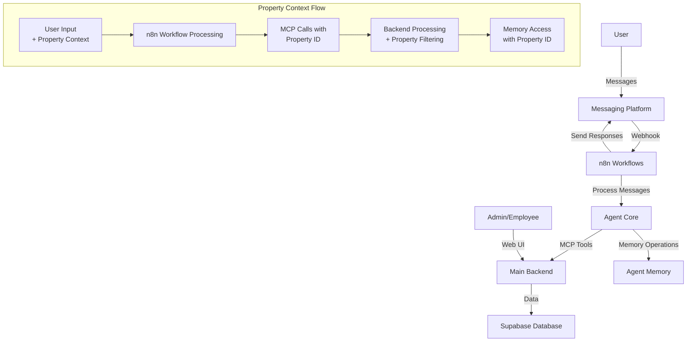
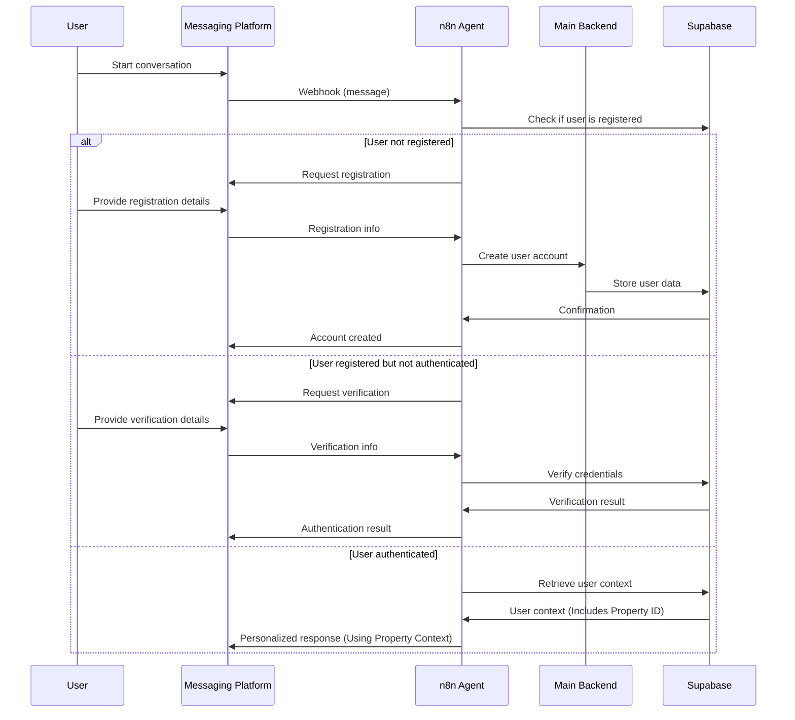
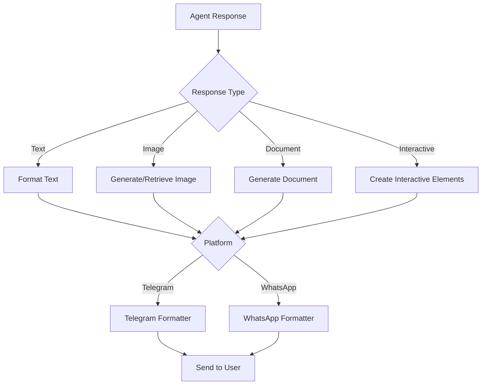

# Messaging Platform Integration Specifications

**⚠️ CRITICAL: READ [PROJECT BRIEF](projectbrief.md) FIRST ⚠️** - The Project
Brief contains the complete Memory Bank navigation guide and reading order for
first interaction. Always start there after any memory reset.

## Overview

This document defines the technical specifications for integrating the Verding
agent with messaging platforms, specifically Telegram and WhatsApp. The
integration will enable users to interact with the system through these
platforms in both one-on-one and group chat contexts, while maintaining context
continuity and ensuring proper authentication and data security.

## 1. Integration Architecture

### 1.1 High-Level Architecture



### 1.2 Key Components

1. **Webhook Receivers**

   - Separate n8n webhook nodes for Telegram and WhatsApp
   - Message validation and preprocessing
   - Error handling for malformed requests

2. **User Identity Management**

   - Mapping between platform-specific user IDs and Verding user accounts
   - Authentication and authorization verification
   - Guest/anonymous user handling with progressive identification

3. **Message Processing Pipeline**

   - Message type detection (text, voice, image)
   - Platform-specific format conversion
   - Routing to appropriate processing workflows

4. **Agent Core Integration**

   - Pass processed messages to Agent Core via internal routing
   - Receive and format responses for each platform
   - Handle multimedia content appropriately

5. **Context Management System**
   - Track conversation context across sessions
   - Link conversations to specific users and groups
   - Maintain context when switching between platforms
   - **Store and manage the active property ID within the session context.**

## 2. Platform-Specific Integration Details

### 2.1 Telegram Integration

#### 2.1.1 Setup Requirements

- Telegram Bot API token
- Webhook URL configuration
- Bot permissions configuration

#### 2.1.2 Message Format

```json
{
  "update_id": 123456789,
  "message": {
    "message_id": 123,
    "from": {
      "id": 12345678,
      "is_bot": false,
      "first_name": "User",
      "last_name": "Name",
      "username": "username",
      "language_code": "en"
    },
    "chat": {
      "id": 12345678,
      "first_name": "User",
      "last_name": "Name",
      "username": "username",
      "type": "private"
    },
    "date": 1612345678,
    "text": "Message text"
  }
}
```

#### 2.1.3 Authentication Approach

- Use Telegram's built-in user ID as a unique identifier
- Link Telegram accounts to Verding accounts through a verification process
- Implement custom commands for authentication (/login, /verify)

#### 2.1.4 Group Chat Handling

- Recognize group chat contexts by "type": "group" or "supergroup"
- Track message ownership within groups
- Implement selective response mechanisms (respond only when mentioned or
  commanded)
- Use thread replies for contextual conversations in busy groups
- **Implement a mechanism to link Telegram group chats to a specific property
  ID, potentially via an agent command.**

#### 2.1.5 Multimedia Support

- Process and respond to:
  - Images (photos and file attachments)
  - Voice messages (transcribe for processing)
  - Documents and files
  - Location data

### 2.2 WhatsApp Integration

#### 2.2.1 Setup Requirements

- Twilio WhatsApp API credentials or WhatsApp Business API
- Webhook URL configuration
- Business account verification

#### 2.2.2 Message Format (Twilio Example)

```json
{
  "SmsMessageSid": "SM123456789",
  "NumMedia": "0",
  "ProfileName": "User Name",
  "SmsSid": "SM123456789",
  "WaId": "12345678901",
  "SmsStatus": "received",
  "Body": "Message text",
  "To": "whatsapp:+12345678901",
  "NumSegments": "1",
  "MessageSid": "SM123456789",
  "AccountSid": "AC123456789",
  "From": "whatsapp:+12345678901",
  "ApiVersion": "2010-04-01"
}
```

#### 2.2.3 Authentication Approach

- Use WhatsApp phone number as a unique identifier
- Implement OTP verification for account linking
- Store verified phone numbers in user profiles

#### 2.2.4 Group Chat Handling

- Use group ID for context tracking
- Implement selective response (when mentioned or with specific commands)
- Support group-specific memory contexts and permissions
- **Implement a mechanism to link WhatsApp group chats to a specific property
  ID.**

#### 2.2.5 Multimedia Support

- Process and respond to:
  - Images
  - Voice notes
  - Documents
  - Location data
  - Contacts

## 3. Context Preservation Strategy

### 3.1 Memory Structure

The system will implement a multi-level context preservation strategy:

1. **Session Context**

   - Short-term memory for immediate conversation (last 10-20 messages)
   - Reset after prolonged inactivity (configurable timeout)
   - Stored in memory or temporary database storage
   - **Should include the active property ID for the session.**

2. **User Context**

   - Medium-term memory of user preferences and recent interactions
   - Persists across sessions
   - Stored in the memory system with appropriate access controls
   - **Should include the user's default property ID and a list of properties
     they have access to.**

3. **Long-term Knowledge**
   - Persistent information about user history, preferences, and patterns
   - Indexed for retrieval based on relevance
   - Stored in the memory system with strict access controls

### 3.2 Cross-Platform Context Management

```mermaid
graph TD
    A[Telegram Message] -->|Extract User ID| B[Identify User]
    C[WhatsApp Message] -->|Extract Phone| B
    B -->|Retrieve Context| D[User Context Store<br>(Includes Property ID)]
    B -->|Process with Context| E[Agent Core]
    E -->|Update Context| D
    E -->|Generate Response| F[Format for Platform]
    F -->|Send to Telegram| G[Telegram API]
    F -->|Send to WhatsApp| H[WhatsApp API]
```

Key aspects:

1. **Unified User Identity**

   - Map platform-specific identifiers to internal user IDs
   - Support multiple linked identities (Telegram ID, WhatsApp number, etc.)
   - Store mapping in secure database with appropriate encryption

2. **Context Transfer Protocol**

   - When user switches platforms, retrieve context based on user ID
   - Include abbreviated previous context in new sessions
   - Use context markers to indicate platform transitions
   - **Ensure the active property ID is transferred with the context.**

3. **Platform-Specific Formatting**
   - Adapt agent responses to platform capabilities
   - Handle multimedia differently based on platform support
   - Preserve intent and content across format translations

## 4. Authentication and Identity Verification

### 4.1 Initial Authentication Flow



### 4.2 Verification Methods

1. **One-Time Password (OTP)**

   - Generate and send via alternative channel (email/SMS)
   - Time-limited validity
   - Rate-limited attempts

2. **Existing Account Linking**

   - Login via web with special code
   - QR code scanning (for Telegram)
   - Email verification link

3. **Multi-Factor Authentication (for sensitive operations)**
   - Combination of platform authentication and secondary verification
   - Administrative approval for certain actions
   - Step-up authentication for sensitive operations

### 4.3 Session Management

- **Timeout:** Implement configurable session timeouts.
- **Renewal:** Allow session renewal with user activity.
- **Property Context in Session:** Ensure the active `property_id` is stored and
  retrieved as part of the session data. Any command requiring property context
  will use this ID if not explicitly provided.

## 5. Agent Commands and Interaction Model

The agent will support a range of text-based commands to interact with the
Verding system. All commands are processed within the context of the user's
authenticated session and active property (if set).

### 5.1 General Command Structure

- Commands typically start with a forward slash (e.g., `/help`).
- Parameters are space-separated after the command.
- Complex parameters (like JSON for widget configuration) should be handled
  gracefully, possibly with guidance from the agent.

### 5.2 Existing Core Commands (Examples - to be expanded)

- `/login <credentials>`: Authenticate the user.
- `/verify <otp_code>`: Complete OTP verification.
- `/set_property <property_name_or_id>`: Sets the active property context for
  the session (calls MCP `switch_active_property_context`).
- `/get_property`: Displays the current active property.
- `/help`: Provides a list of available commands. // ... other existing general
  commands for various modules ...

### 5.3 Monitoring & Dashboard Commands (New)

This section details commands related to the Monitoring & Dashboard features
(MCP Category 14). These commands allow users to manage and view monitoring
dashboards and their components directly from messaging platforms.

#### 5.3.1 Dashboard Management

- **`/dashboard list`**
  - **Description:** Lists all accessible monitoring dashboards for the current
    active property.
  - **MCP Tool:** `list_dashboards` (14.3)
- **`/dashboard show <dashboard_name_or_id>`**
  - **Description:** Displays details for a specific dashboard. May provide a
    direct link to the web UI for complex dashboards or a summary via text.
  - **MCP Tool:** `get_dashboard` (14.2)
- **`/dashboard create <name> [description]`**
  - **Description:** Creates a new dashboard.
  - **MCP Tool:** `create_dashboard` (14.1)
  - _Example:_
    `/dashboard create "Morning Check" "Daily overview of key sensors"`
- **`/dashboard delete <dashboard_name_or_id>`**
  - **Description:** Deletes a specified dashboard.
  - **MCP Tool:** `delete_dashboard` (14.5)
- **`/dashboard duplicate <source_dashboard_name_or_id> <new_name>`**
  - **Description:** Duplicates an existing dashboard.
  - **MCP Tool:** `duplicate_dashboard` (14.6)
  - _Example:_ `/dashboard duplicate "Morning Check" "Afternoon Review"`

#### 5.3.2 Dashboard Sharing

- **`/dashboard share public <dashboard_name_or_id> [days_valid]`**
  - **Description:** Generates a publicly accessible URL for the specified
    dashboard. `days_valid` defaults to system setting (e.g., 7 days).
  - **MCP Tool:** `generate_public_dashboard_url` (14.19)
  - **Output:** The agent will respond with the public URL. If OTP is enabled
    for the generated link, the agent will provide instructions on how the user
    can securely receive/view the OTP (details of OTP delivery mechanism are TBD
    and need careful security consideration, potentially involving a link to a
    secure page or a separate notification).
  - _Example:_ `/dashboard share public "Investor Overview" 30`
- **`/dashboard share user <dashboard_name_or_id> <user_identifier> <permission_level>`**
  - **Description:** Shares a dashboard with another Verding user.
    `user_identifier` can be email or user ID. `permission_level` can be 'view'
    or 'edit'.
  - **MCP Tool:** `set_dashboard_sharing_settings` (14.18 - for user-specific
    sharing)
  - _Example:_
    `/dashboard share user "Team Alpha Dashboard" "johndoe@example.com" view`
- **`/dashboard share role <dashboard_name_or_id> <role_name> <permission_level>`**
  - **Description:** Shares a dashboard with users having a specific role within
    the property.
  - **MCP Tool:** `set_dashboard_sharing_settings` (14.18 - for role-specific
    sharing)
  - _Example:_ `/dashboard share role "Team Alpha Dashboard" "manager" edit`
- **`/dashboard unshare public <dashboard_name_or_id> <url_id>`**
  - **Description:** Revokes a specific public URL. The `url_id` would be
    provided when the URL was generated or via `/dashboard sharing_details`.
  - **MCP Tool:** `revoke_public_dashboard_url` (14.20)
- **`/dashboard sharing_details <dashboard_name_or_id>`**
  - **Description:** Lists current sharing settings and active public URLs for a
    dashboard.
  - **MCP Tool:** `list_dashboard_sharing_details` (14.21)

#### 5.3.3 Widget Management (Simplified for Chat)

- **`/widget list <dashboard_name_or_id>`**
  - **Description:** Lists widgets on a specified dashboard.
  - **MCP Tool:** `list_widgets_on_dashboard` (14.11)
- **`/widget show <widget_name_or_id>`**
  - **Description:** Shows details of a specific widget. For data-intensive
    widgets, this might provide a summary or a link to view it in the web UI or
    a shared dashboard.
  - **MCP Tool:** `get_widget` (14.8)
- **`/widget add <dashboard_name_or_id> type <widget_type> [config_json]`**
  - **Description:** Adds a widget to a dashboard. `config_json` might be
    simplified for chat or guide the user. Complex configurations are better
    suited for the web UI.
  - **MCP Tool:** `add_widget_to_dashboard` (14.7)
  - _Example (simple):_
    `/widget add "Morning Check" type sensor_realtime {"sensor_id":"sensor123"}`
- **`/widget remove <dashboard_name_or_id> <widget_name_or_id>`**
  - **Description:** Removes a widget from a dashboard.
  - **MCP Tool:** `remove_widget_from_dashboard` (14.10)
- **`/widget types`**
  - **Description:** Lists available widget types that can be added.
  - **MCP Tool:** `get_available_widget_types` (14.12)

#### 5.3.4 Data Retrieval & Alerts (Simplified for Chat)

- **`/widget data <widget_name_or_id>`**
  - **Description:** Retrieves data for a specific widget. The agent will decide
    the best presentation:
    - Simple data (e.g., single sensor value from MCP 14.13) may be displayed
      directly.
    - Complex data (e.g., historical trends from MCP 14.14, KPI data from MCP
      14.15) will likely be presented as a summary or a link to the
      dashboard/widget in the web UI.
  - **MCP Tools:** `get_widget_data_sensor_realtime` (14.13),
    `get_widget_data_sensor_historical` (14.14), `get_widget_data_kpi` (14.15),
    etc.
- **`/alert list [dashboard_name_or_id]`**
  - **Description:** Lists active alerts, optionally filtered by dashboard.
  - **MCP Tool:** `get_dashboard_alerts` (14.22)
- **`/alert ack <alert_id>`**
  - **Description:** Acknowledges a specific alert.
  - **MCP Tool:** `acknowledge_dashboard_alert` (14.23)

### 5.4 Property Context for Commands

- All Monitoring & Dashboard commands operate within the user's currently active
  property context.
- If no property is active, commands requiring property context will prompt the
  user to set one using `/set_property`.
- The agent must ensure the `property_id` from the session context is passed to
  the corresponding MCP tools.

## 6. Message Flow and Processing

### 6.1 Text Message Processing

1. **Input Preprocessing**

   - Strip platform-specific formatting
   - Normalize text (spaces, line breaks, etc.)
   - Handle emojis and special characters

2. **Output Formatting**
   - Add platform-appropriate styling (bold, italic, etc.)
   - Chunk long messages according to platform limits
   - Add continuation indicators for multi-part messages

### 6.2 Multimedia Processing

1. **Image Handling**

   - Accept images from users (with captions)
   - Process with image recognition if needed
   - Generate or retrieve images for responses
   - Format according to platform requirements

2. **Voice Messages**

   - Transcribe incoming voice messages
   - Process transcribed content
   - Generate voice responses when appropriate
   - Handle voice attachments as data when needed

3. **Document Handling**
   - Process attached documents (extracts, summaries)
   - Generate documents for complex responses
   - Support common formats (PDF, DOCX, etc.)
   - Handle size limitations appropriately

### 6.3 Rich Media Responses



Platform-specific interactive elements:

- Telegram: Inline keyboards, custom keyboards, buttons
- WhatsApp: List messages, reply buttons, call-to-action buttons

## 7. Error Handling for Property Context

- Update error handling to provide specific feedback if a user attempts an
  action without a clear property context or for a property they don't have
  access to.
- Error messages should guide the user to select a property or provide the
  necessary property information.

## 8. Implications for Existing Sections

- Review Section 2 (Platform-Specific Integration Details) to ensure that
  message processing workflows extract or confirm property context where
  applicable.
- Review Section 3.1 (Memory Structure) to reinforce that session context and
  user context should include property information.
- Review Section 4 (Authentication and Identity Verification) to ensure that
  property access is considered during the linking process.

## 9. Message Formatting and Multimedia Handling

### 9.1 Text Message Processing

1. **Input Preprocessing**

   - Strip platform-specific formatting
   - Normalize text (spaces, line breaks, etc.)
   - Handle emojis and special characters

2. **Output Formatting**
   - Add platform-appropriate styling (bold, italic, etc.)
   - Chunk long messages according to platform limits
   - Add continuation indicators for multi-part messages

### 9.2 Multimedia Processing

1. **Image Handling**

   - Accept images from users (with captions)
   - Process with image recognition if needed
   - Generate or retrieve images for responses
   - Format according to platform requirements

2. **Voice Messages**

   - Transcribe incoming voice messages
   - Process transcribed content
   - Generate voice responses when appropriate
   - Handle voice attachments as data when needed

3. **Document Handling**
   - Process attached documents (extracts, summaries)
   - Generate documents for complex responses
   - Support common formats (PDF, DOCX, etc.)
   - Handle size limitations appropriately

### 9.3 Rich Media Responses


Platform-specific interactive elements:

- Telegram: Inline keyboards, custom keyboards, buttons
- WhatsApp: List messages, reply buttons, call-to-action buttons

## 10. Group Chat Management Approach

### 10.1 Activation Mechanisms

1. **Direct Mention**

   - Respond when the bot is explicitly mentioned (@BotName)
   - Support variations of the bot name for flexibility

2. **Command Prefixes**

   - Respond to messages starting with specific prefixes (/, !, #)
   - Support customizable command sets for different functions

3. **Context-Aware Activation**
   - Continue conversations based on recent interaction
   - Use timers to determine when to stop responding without explicit commands

### 10.2 Conversation Threading

1. **Message Grouping**

   - Track conversation threads within groups
   - Link related messages together
   - Maintain separate contexts for different threads

2. **Thread Isolation**
   - Prevent context bleed between unrelated conversations
   - Support multiple concurrent threads in busy groups
   - Clear thread contexts when resolved

### 10.3 Group-Specific Features

1. **Group Memory**

   - Maintain shared context for the entire group
   - Track group-level preferences and settings
   - Support group-specific command restrictions

2. **Role-Based Interactions**

   - Respect group admin/owner privileges
   - Implement command restrictions based on user roles
   - Support administrative commands for group management

3. **Multi-User Coordination**
   - Handle overlapping requests gracefully
   - Implement fairness mechanisms for resource allocation
   - Support explicit "conversation locking" for complex interactions

## 11. Error Handling and Recovery

### 11.1 Message Delivery Failures

1. **Platform API Errors**

   - Implement exponential backoff for retries
   - Store messages for delayed delivery
   - Notify users of delivery issues when persistent

2. **Content Filtering Issues**
   - Handle platform-rejected content (inappropriate, spam, etc.)
   - Provide alternative delivery methods when needed
   - Log filtering events for analysis

### 11.2 Context Recovery

1. **Session Restoration**

   - Implement "continue previous conversation" functionality
   - Provide context summaries after long breaks
   - Support explicit context reset commands

2. **Error Fallbacks**
   - Graceful degradation of functionality
   - Text-only alternatives for rich media failures
   - Platform-specific workarounds for known limitations

## 12. Implementation Workflow in n8n

The integration will be implemented as a set of n8n workflows:

### 12.1 Core Workflows

1. **Platform Message Receivers**

   - Separate webhook endpoints for each platform
   - Initial message validation and normalization
   - User identification and routing

2. **Main Message Processing Workflow**

   - Receive message and property context.
   - Identify user and retrieve user-specific context (including properties they
     have access to).
   - **Validate if the user has access to the determined property context.**
   - Process message using NLP and intent recognition.
   - **When making MCP calls, include the determined property ID in the
     parameters.**
   - **When accessing memory, use the determined property ID for filtering.**
   - Generate response.
   - Pass response and original chat ID to the response sending workflow.

3. **Response Sending Workflow**
   - Platform-specific output formatting
   - Multimedia generation and handling
   - Message chunking and sequencing

### 12.2 Support Workflows

1. **User Authentication**

   - Registration and verification flows
   - Account linking processes
   - Authentication refresh handling

2. **Error Management**

   - Error detection and classification
   - Recovery procedures
   - Administrative notifications

3. **Analytics and Monitoring**
   - Usage tracking
   - Error rate monitoring
   - Performance metrics collection

## 13. Security Considerations

### 13.1 Data Protection

1. **Message Content**

   - End-to-end encryption where supported
   - Secure storage of message histories
   - Automatic purging of sensitive information
   - Compliance with data protection regulations

2. **Authentication Credentials**
   - Secure storage of API tokens and credentials
   - Regular rotation of secrets
   - Environment-based configuration isolation

### 13.2 Access Controls

1. **Platform Permissions**

   - Minimal required bot permissions
   - Scope limitation for API access
   - Regular permission audits

2. **User Authorization**

   - Role-based command restrictions
   - Progressive permission elevation
   - Contextual security checks

3. **Ensure n8n workflows enforce property-level access control before
   performing actions or retrieving data.**

## 14. Testing and Validation

### 14.1 Test Scenarios

1. **Functional Testing**

   - One-on-one conversations (text, multimedia)
   - Group interactions
   - Cross-platform context preservation
   - Authentication flows

2. **Edge Cases**
   - Network interruptions
   - Platform API changes
   - Rate limiting and throttling
   - Concurrent user interactions

### 14.2 Validation Metrics

1. **Performance**

   - Response time measurements
   - Throughput capabilities
   - Resource utilization

2. **Reliability**
   - Error rates
   - Recovery success rates
   - Uptime measurements

## 15. Deployment and Scaling Strategy

### 15.1 Initial Deployment

1. **Phased Rollout**

   - Private beta with limited users
   - Platform-by-platform activation
   - Feature-by-feature enablement

2. **Monitoring Setup**
   - Real-time usage dashboards
   - Error alerts and notifications
   - Performance tracking

### 15.2 Scaling Approach

1. **Horizontal Scaling**

   - Multiple n8n instances for high-volume platforms
   - Load balancing across workflow executors
   - Distributed webhook receivers

2. **Resource Optimization**
   - Caching frequently used contexts
   - Efficient media processing pipelines
   - Batched database operations

## 16. Future Extensions

### 16.1 Additional Platforms

- Discord integration
- Slack workspace support
- SMS fallback mechanisms
- Custom web chat widgets

### 16.2 Enhanced Features

- Cross-platform conversation migration
- Rich interactive elements (forms, calendars)
- Platform-specific AI tuning
- Multilingual support optimization

## Conclusion

This specification provides a comprehensive framework for integrating the
Verding agent with messaging platforms, specifically Telegram and WhatsApp. The
implementation will leverage n8n workflows to create a robust, scalable system
that maintains context across platforms while ensuring security and user
privacy. The architecture supports both one-on-one and group chat scenarios,
with appropriate handling for authentication, multimedia content, and error
recovery.
